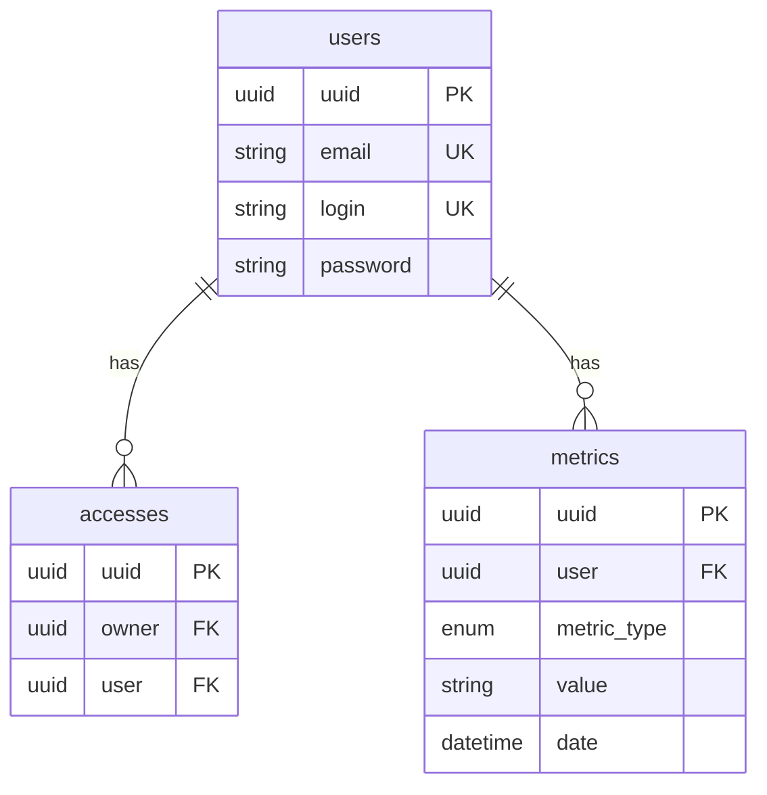
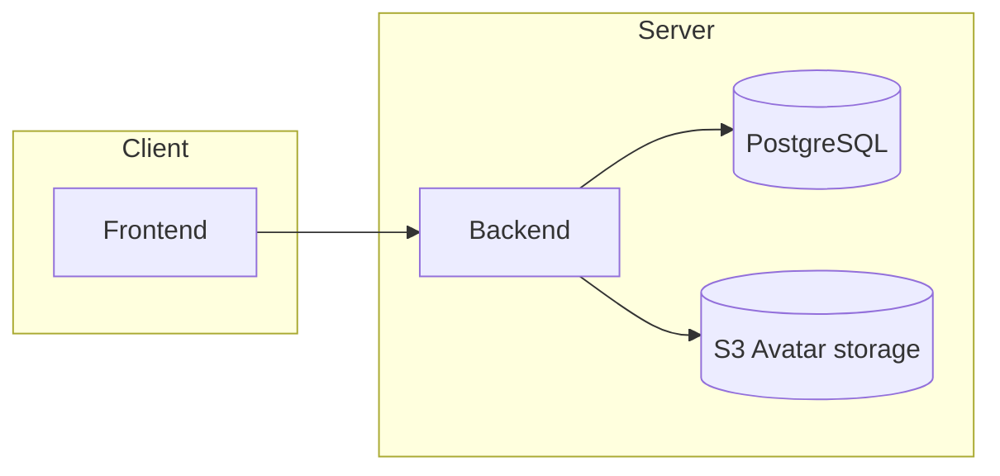

# Health metrics

Web-приложение для ведения метрик по здоровью и расшаривания ими с другими
пользователями.

## Схема базы данных

```mermaid
erDiagram
	users {
		uuid uuid PK
		string email UK
		string login UK
		string password
	}

	metrics {
		uuid uuid PK
		uuid user FK
		enum metric_type
		string value
		datetime date
	}

	accesses {
		uuid uuid PK
		uuid owner FK
		uuid user FK
	}

	users ||--o{ accesses : has
	users ||--o{ metrics : has
```

## Верхнеуровневая архитектура

```mermaid
flowchart LR
	subgraph Client
	Frontend
	end

	subgraph Server
	Frontend --> Backend
	Backend --> db[(PostgreSQL)]
	Backend --> s3[(S3 Avatar storage)]
	end
```
